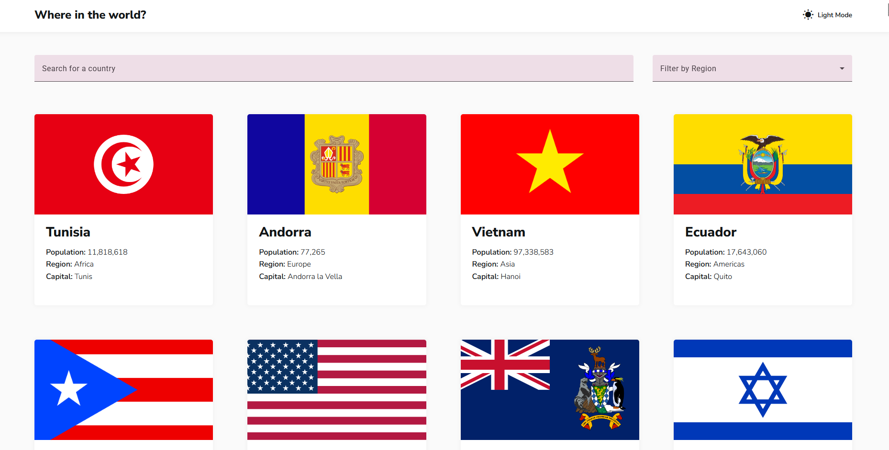
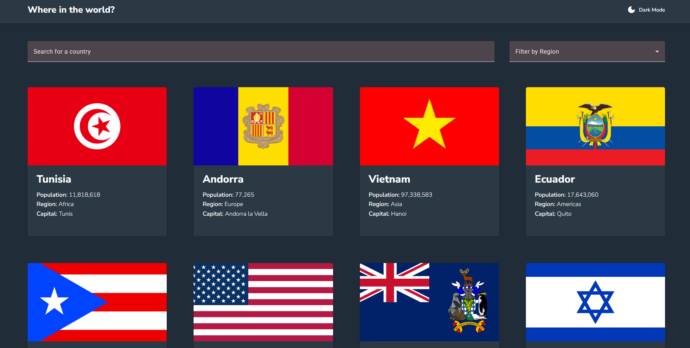
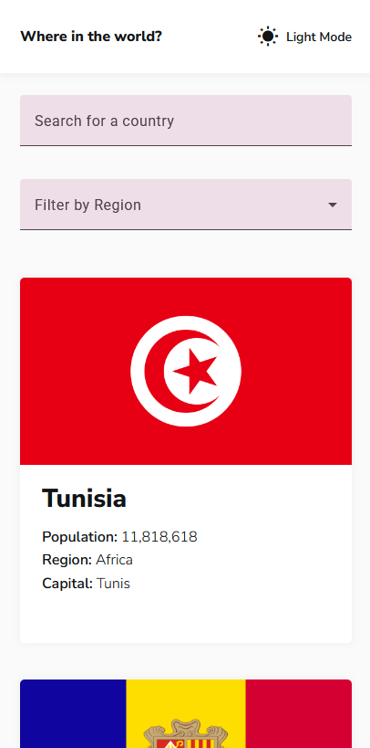
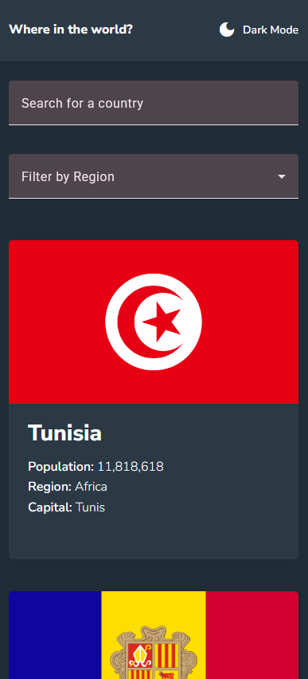
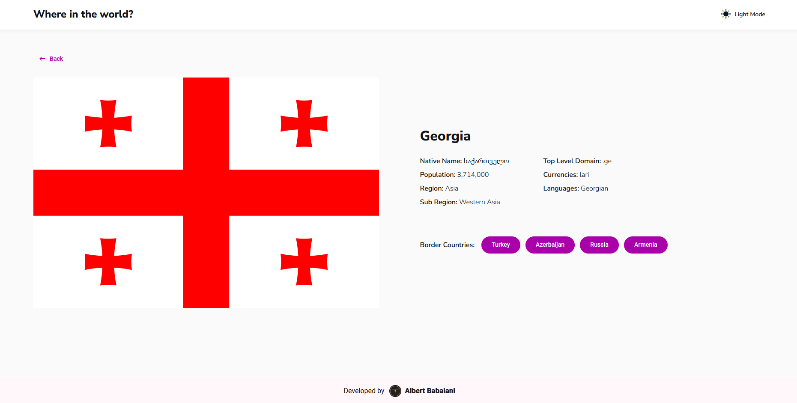
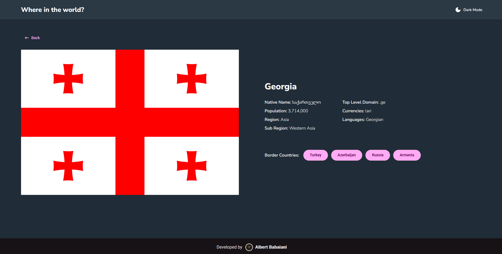

# REST Countries API with Color Theme Switcher 🌍

This is a solution to the [REST Countries API with color theme switcher challenge on Frontend Mentor](https://www.frontendmentor.io/challenges/rest-countries-api-with-color-theme-switcher-5cacc469fec04111f7b848ca). This project allows users to browse through all countries, filter them by region, search for a specific country, and view more detailed information on a dedicated page. It also features a fully functional light/dark mode theme switcher.

### ✨ [View Live Demo](https://albertbabaiani.github.io/rest-countries-app/)

---

## Table of Contents

- [The Challenge](#the-challenge)
- [Screenshots](#screenshots)
- [Links](#links)
- [Built With](#built-with)
- [Features](#features)
- [Installation](#installation)
- [Author](#author)
- [Acknowledgments](#acknowledgments)

---

## The Challenge

Users should be able to:

- See all countries from the API on the homepage.
- Search for a country using an `input` field.
- Filter countries by region.
- Click on a country to see more detailed information on a separate page.
- Click through to the border countries on the detail page.
- Toggle the color scheme between light and dark mode.
- View the optimal layout for the app depending on their device's screen size.

---

## Screenshots

### Desktop Preview

#### Home Page












## Links

- **Figma Design:** [Figma Link for REST Countries API](<https://www.figma.com/file/B3G6S34n2PhsSCp6xpeIaj/rest-countries-api-with-color-theme-switcher-v2-(Community)?type=design&node-id=0-1&mode=design&t=D5B8f9V1xovblGn8-0>)
- **Live Site URL:** [https://albertbabaiani.github.io/rest-countries-app/](https://albertbabaiani.github.io/rest-countries-app/)

---

## Built With

This project was built using modern web development technologies and libraries to create a responsive and dynamic user experience.

- **Framework:** [Angular](https://angular.io/)
- **UI Library:** [Angular Material](https://material.angular.io/)
- **Styling:**
  - SCSS (Sass)
  - CSS Flexbox & Grid
  - Mobile-First Workflow
- **State Management & Asynchronicity:**
  - RxJS
  - Angular Signals
- **API:** [REST Countries API](https://restcountries.com/)
- **Tools:**
  - Angular CLI
  - TypeScript
  - Visual Studio Code

---

## Features

- **Dark/Light Mode Theme Toggle:** Seamlessly switch between a light and dark theme, with preferences saved in local storage.
- **Live Search:** Dynamically filters countries on the homepage as the user types.
- **Region Filtering:** Allows users to filter the displayed countries by continent.
- **Detailed Country View:** Clicking on a country card navigates to a detailed page with information like native name, sub-region, currencies, languages, and more.
- **Border Country Navigation:** On the detail page, users can click on border countries to navigate directly to their respective detail pages.
- **Robust Error Handling:** Navigating to a non-existent country URL redirects to a clean "404 Not Found" page.
- **Fully Responsive Design:** The layout adapts beautifully from small mobile screens to large desktop displays.

---

## 🚀 Installation

To run this project locally, follow these simple steps.

1.  **Clone the repository**
    ```sh
    git clone [https://github.com/AlbertBabaiani/rest-countries-app.git](https://github.com/AlbertBabaiani/rest-countries-app.git)
    ```
2.  **Navigate to the project directory**
    ```sh
    cd rest-countries-app
    ```
3.  **Install NPM packages**
    ```sh
    npm install
    ```
4.  **Run the application**
    ```sh
    ng serve
    ```
    The application will be available at `http://localhost:4200/`.

---

## Author

- **Albert Babaiani**
- **GitHub:** [@AlbertBabaiani](https://github.com/AlbertBabaiani)

---

## Acknowledgments

- A big thank you to [Frontend Mentor](https://www.frontendmentor.io) for providing this challenging and educational project.
- The [REST Countries API](https://restcountries.com/) for providing the data.
